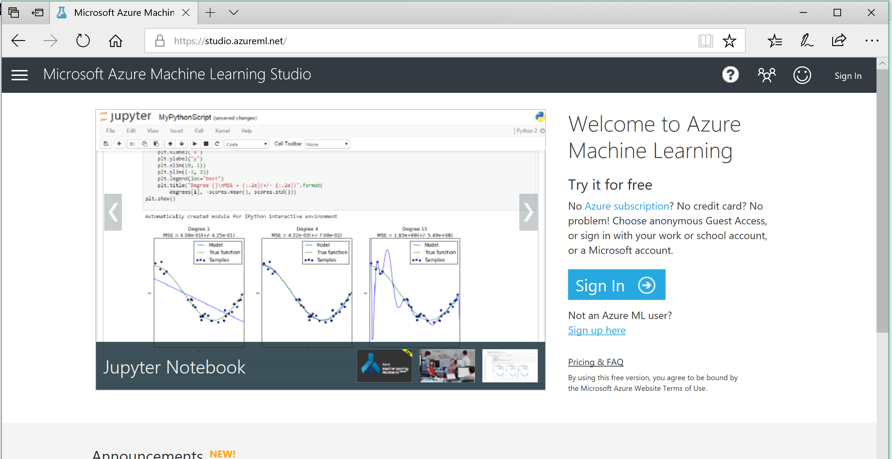
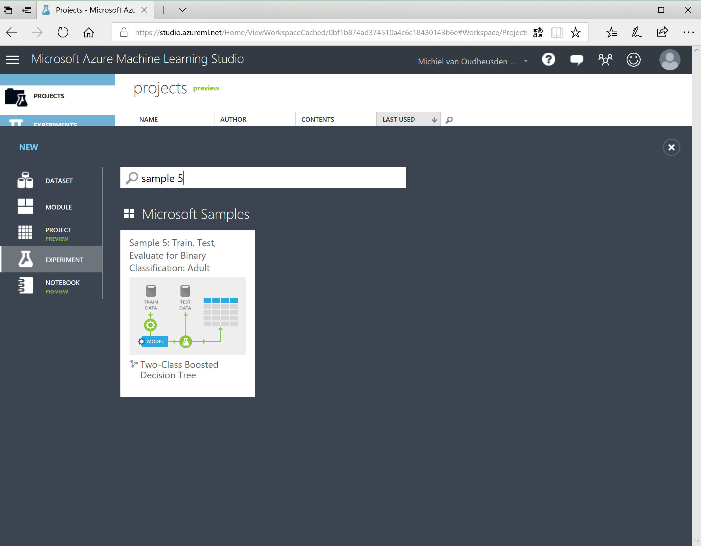
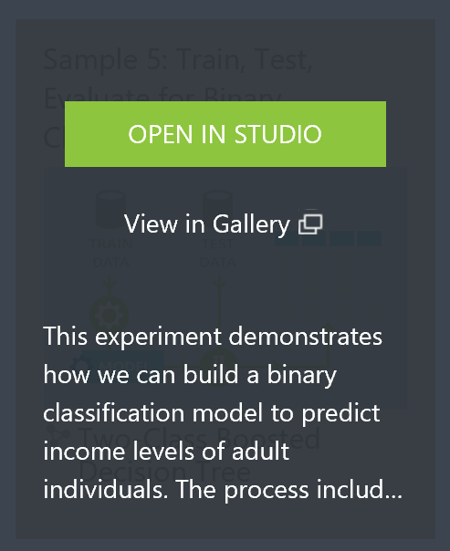
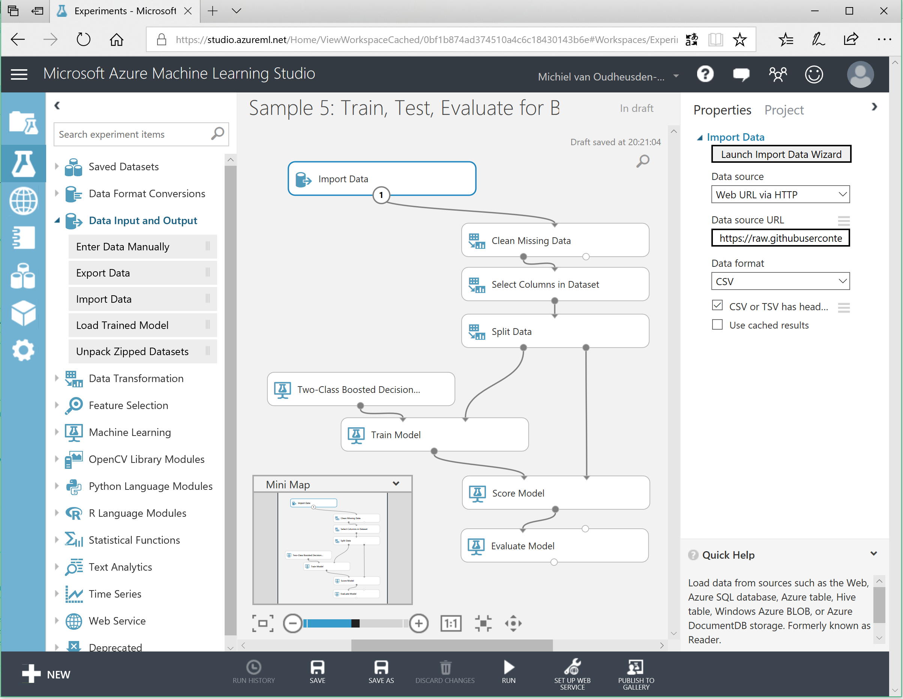
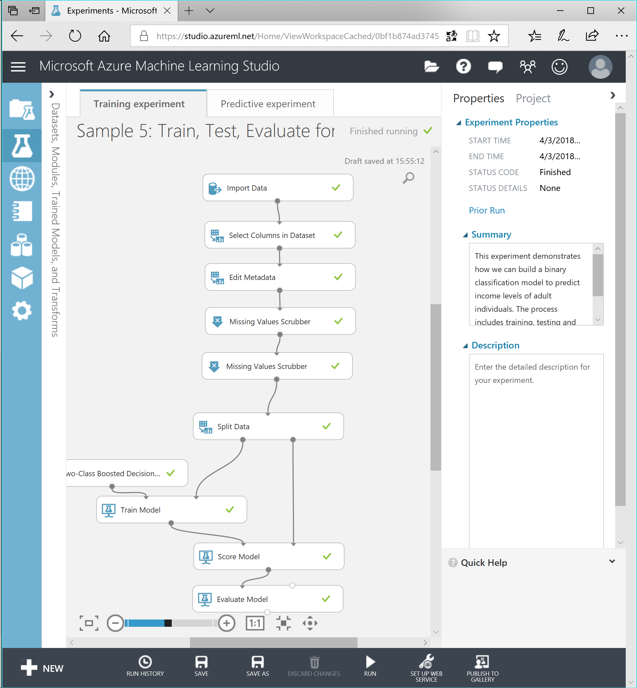
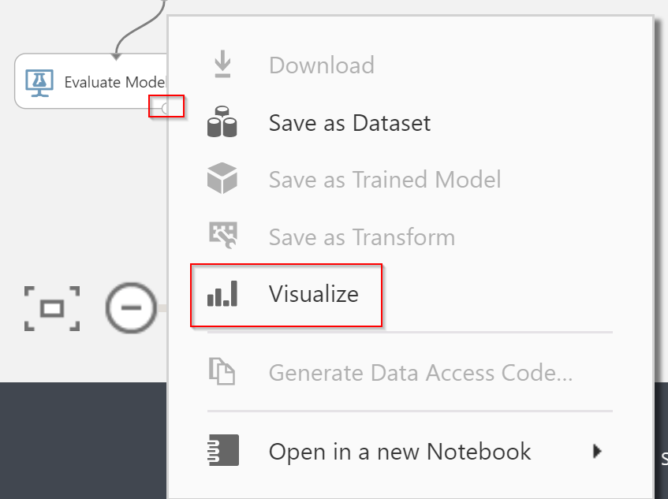

# Step 1; build the ML model

Below we will outline some of the steps needed to complete the first part. There are a lot of options which can be used to alter the model and thus the accuracy of the system. Change, run and evaluate to see if you can get a better model.

## Login to the Azure ML studio

Before you can start using the Azure ML studio, you need to make sure you have an account. Visit the [Azure Machine Learning Studio](https://studio.azureml.net/) where you will find a **Sign In** and **Sign Up** button.

When signed up or signed in, you will enter the Azure ML Studio.

## Begin an experiment

We start by creating an experiment. Click on the big plus button at the bottom of the screen to bring the Samples selector in view. We will use an existing sample as a starting point although we will need to make some adjustments.

Search for `Sample 5` which should give you one result as visualized below.

Hover over the Sample 5 card and select _Open in studio_.

You will now have a nice starting point to begin building your own model for this workshop.

## Import data

As we are not interested in this specific sample data but want to analyze our victim data set, we need to import our data. Remove the existing `Adult Census Income Binary Classification dataset` and replace it with an `Import Data` block. Select CSV as the data source and select as data source the `Web URL via HTTP`. Also select the option to indicate that the CSV has headers.

The file to import can be found in [GitHub](https://raw.githubusercontent.com/XpiritBV/GABC2018_HandsOnLabs/master/ML/TheFamily.csv).

## Select data

As we do not need all the data columns, we need to clean some of the data. Use a *Select Columns in Dataset* block to exclude the Name, FamilyMemberId, LastSeenAtCode and PassportNr columns. Keep all the other columns, we need them for the analysis.

## Edit metadata

The next step is to make the data categorical. This tells the system how to use the columns further downstream. You can use an *Edit Metadata* block for this. Make sure to select the *Make Categorical* option and apply this on Rank, Neighbourhood, Alive and Gender columns.  

## Scrub the data

Not all the data is clean enough. We have missing values, empty rows ec, so we need to clean the dataset. The 'Missing Value Scrubber' can be used for this purpose. We advise to place two of those after each other. The first one needs to replace missing values with the median and the second one should just drop the entire row when there are any leftover missing values.

## Split

Time to split the data, we need some of it to train, some of it to learn the model. You can keep the 70/30 split, but feel free to experiment what works better.

## Train

Part of the split data goes to the model training part. Which is based on the *two-class boosted decision tree*. There are more classification options available, so when you have time, try some others to see how they score (see below for an explanation how to check the scoring). Make sure to select the IsAlive column as the columns you want to train for.

## Score and evaluate

After training, you use the other part of the split data to score and evaluate the model. 

The end result of these steps should be something like the below:

Try to run often and visualize the results by right-clicking on the *Evaluate Model* block and selecting *Evaluation results* / *Visualize*.

See if you can hit an accuracy of around 82%

When completed, go to [step 2](step2.md).
