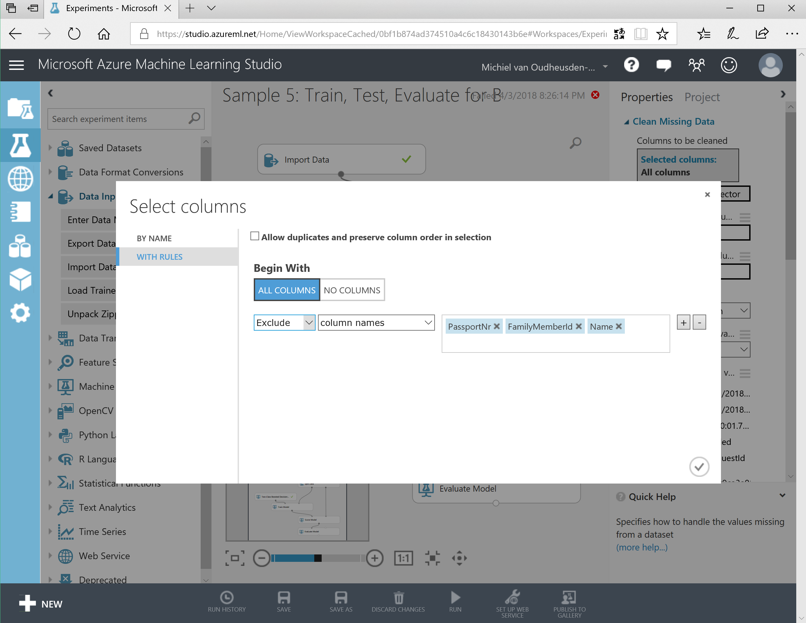

# Step 1; build the ML model

## Login to the Azure ML studio

Before you can start using the Azure ML studio, you need to make sure you have an account. Visit the [Azure Machine Learning Studio](https://studio.azureml.net/) where you will find a Sign In and Sign Up button.

When signed up or logged in, you will enter the Azure ML Studio.

## Begin an experiment

We start by creating an experiment. Click on the big plus button at the bottom of the screen to bring the Samples selector in view. We will use an existing sample as a starting point.

Search for `Sample 5` which should give you one result as visualized below.

Hover over the Sample 5 card and select _Open in studio_.

You will now have a nice starting point to begin building your own model for this workshop.

## Import data

As we are not interested in this specific sample data but want to analyze our victim data, we need to import our dataset. Remove the existing `Adult Census Income Binary Classification dataset` and replace it with an `Import Data` block. Select CSV as the data source and select as data source the `Web URL via HTTP`. 

The file to import can be found in [GitHub](https://raw.githubusercontent.com/XpiritBV/GABC2018_HandsOnLabs/master/ML/TheFamily.csv).

Connect the data import block to the `Clean Missing Data` block.

## Select data

As we do not need all the data columns, we can clean some of the data. Include a 

## Edit metadata

Categorize data...

## Scrub the data

Not all the data is needed, so we need to clean the dataset. The 'Clean Missing Data' can be used for this purpose.

Remove the columns by excluding them from the set:

## Split

## Train

## Score and evaluate

