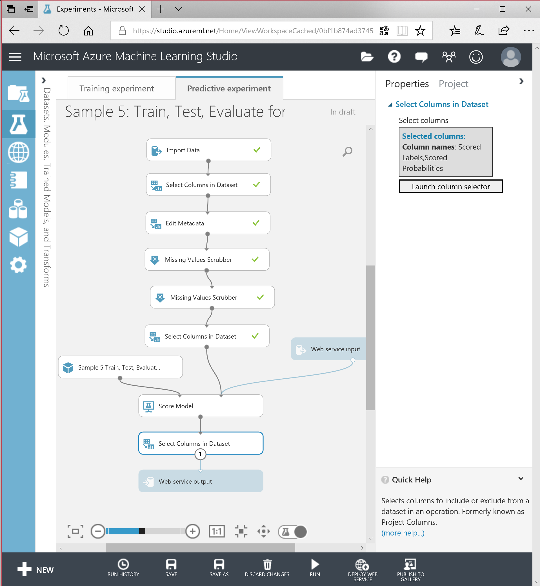

# Step 2; deploy the web service

When you have a model that is accurate enough for your needs, you can convert it into a web service. This allows you to submit data to your trained model and get a result. We want to know if a submitted dataset returns a 1 or a 0. So either alive or dead and the certainty of this outcome.
The data we are offering is a part of the total dataset; the Rank, Age, Gender, Income and Part of the city.

## Set up web service

Next to the **Run** button, you will find a **Set up web service** button which allows you to create or update the web service. Click on it and a new Predictive experiment will appear based on the original (trained) model. We need to make a few modifications.

## Input and output

The web service input we need to connect to the *Score Model* block, while the web service output will become the last step after scoring the model.

## Selecting columns

Just before the scoring of the model, add a *Select Columns in Dataset* block to filter out the Alive column. Before the web service output block, add a similar column selection block and select only the Scored Labels and Scored Probabilities.

## Final experiment

Your final predictive experiment will look like this:

Save and run to validate the experiment. When you are satisfied, select the *Deploy web service* button on the bottom toolbar. 

You are now ready for [step 3](step3.md).
