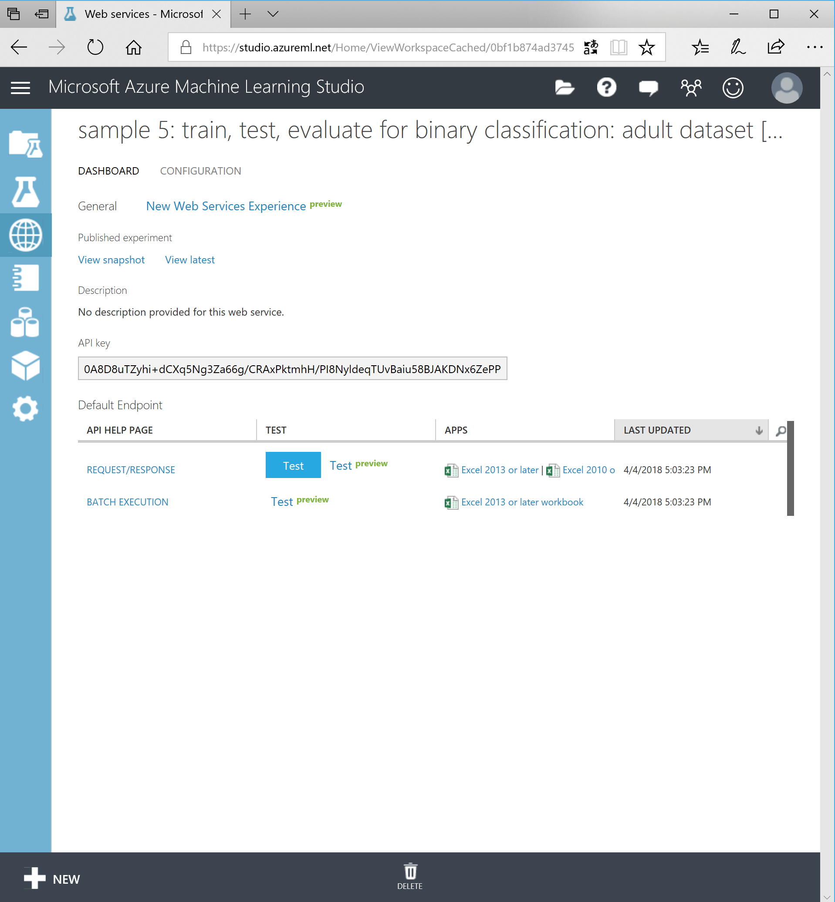

# Step 3; find the victim!

In the previous step, we created the web service. Now you have a way to talk to your model and get predictions back.

The web service will look like something below:

There is both a request/response endpoint as well as a batch endpoint and both contain instructions on how to consume. The preview pages of the Test also contain an online test form and even ready to use C# code to call the API.

## Who will be killed next?

We built this model to predict who will be the next victim and with some hints, we should be able to query the system and find out who will most likely not survive the night.

We detected a new mob family moving into town. Their properties are listed below and are not part of the already trained model. Use the following data and record the outcome.

|Rank|Gender|Age|SiblingSpouse|ParentChild|Income|Neighbourhood|Name|
|--|--|--|--|--|--|--|--|
|3|female|34.5|0|0|7.8292|Q|Maria Licciardi|   
|3|female|18|0|0|7.2292|C|Connie Corleone|     
|3|male|17|0|0|7.8958|S|Al Capone|      
|1|male|40|1|5|311.3875|C|Lucky Luciano|    
|2|male|36|1|1|3690|C|John Dillinger|

**Note:** you can use the button 'Test (preview)' to feed the parameters to the service for easy testing.

## The tip!

It turned out that the above data is not totally up to date. One of those family members was recently demoted from boss to henchman and forced to move to Queens. We do not know why, but he messed up seriously. Maybe he will be wacked by his own...

