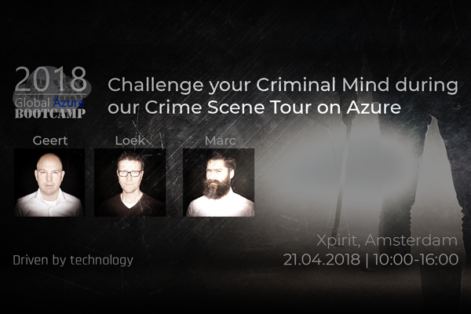

# Global Azure Bootcamp 2018

Challenge yourself to solve riddles, murders, crimes and other crime related mysteries… on Azure!  

## Schedule

Here’s our schedule:

- 10:00 -10:30 > Welcome & Coffee
- 10:30 -11:00 > **Geert van der Cruijsen**   
Big Brother is watching you! In this challenge you’ll be building an all seeing Police artificial intelligence system powered by Azure Cognitive Services that can recognise criminals and weapons based on images or video feeds from the crime scene.

- 11:00 -11:30 > **Loek Duys**  
An anonymous tip came in last night.. A murder is about to be committed. You will guide the agents of the State Police when and where to start their investigation, with the help of Azure Machine Learning. 
- 11:30 -12:00 > **Marc Duiker**  
Join the CSI New York team and analyze crimes using the Azure platform! We will use DataFactory to import a dataset with crimes committed in New York City and we will extract information from it, based on geospatial queries.
- 12:00 -12:30 > Lunch
- 12:30 -16:00 > Hands-on Labs.   
Three tracks to get started learning Azure Cognitive Services, Machine Learning and DataFactory.

Don't forget to bring your laptop!  
See you soon!!

